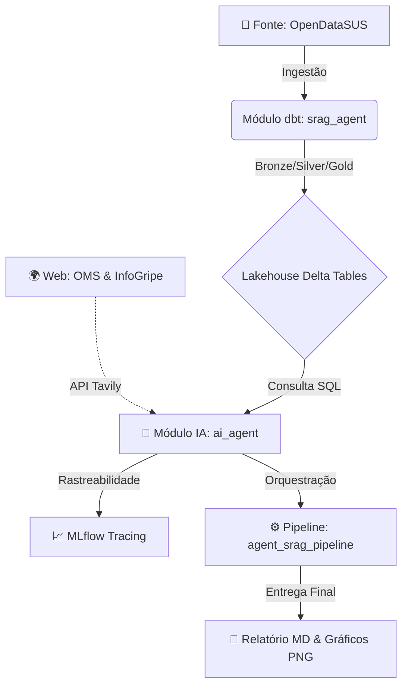
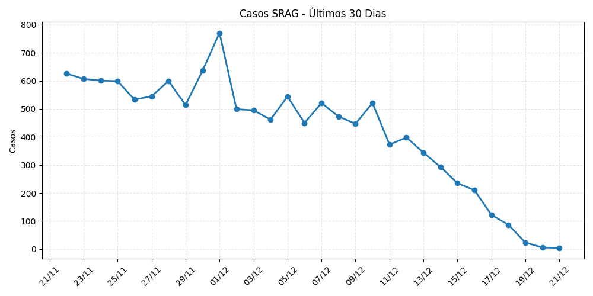

# 🏥 SRAG Intelligent Monitoring System
> **Monitoramento Epidemiológico Automatizado com Agentes de IA**


Este projeto implementa uma solução *end-to-end* para monitoramento de Síndrome Respiratória Aguda Grave (SRAG) no Brasil. A solução integra Engenharia de Dados moderna (Lakehouse) com um **Agente Autônomo de IA** capaz de analisar dados, gerar gráficos e buscar contexto epidemiológico na web em tempo real.

## Arquitetura do Projeto

O repositório está organizado em três módulos estratégicos, simulando um ambiente de produção:



## Estrutura de Pastas

A organização do repositório reflete uma arquitetura de dados moderna e segregada por responsabilidade:

| Diretório | Função | Stack Tecnológica |
| :--- | :--- | :--- |
| **`/srag_agent`** | **Engenharia de Dados (dbt):** Transformação dos dados brutos do SUS seguindo arquitetura Medallion (Bronze, Silver, Gold). Inclui testes de Data Quality. | **dbt Core**, Spark SQL |
| **`/ai_agent`** | **Núcleo de Inteligência:** Contém o notebook do Agente ReAct, ferramentas (Tools) e evidências de execução (Artifacts). | **LangChain**, LangGraph, Llama 3, Tavily |
| **`/agent_srag_pipeline`** | **Orquestração:** Definição dos Jobs e Workflows para execução recorrente e automatizada. | **Databricks Asset Bundles (DABs)** |
---

## O Agente de IA (Módulo `ai_agent`)

O Agente ReAct é orquestrado via **LangGraph**. Ele não apenas "responde perguntas", mas **executa ações** sequenciais para construir um relatório técnico, decidindo sozinho qual ferramenta usar.

### Ferramentas Desenvolvidas
* **📊 Análise SQL (`get_latest_srag_metrics`):** O agente escreve e executa SQL na tabela Gold do Lakehouse para extrair KPIs exatos (mortalidade, ocupação de UTI, vacinação).
* **📈 Visualização de Dados (`generate_srag_charts`):** Gera gráficos em Python (Matplotlib) e salva no Volume do Databricks para auditoria e exibição futura.
* **🌍 Inteligência Web (`get_epidemiological_context`):** Conecta-se à API Tavily para buscar boletins recentes da OMS e InfoGripe (Fiocruz), garantindo que a análise tenha contexto externo atualizado (*Grounding*).

###  Governança & Segurança
Para garantir que a solução seja robusta e segura para o ambiente corporativo:

1.  **Data Quality Gate (Circuit Breaker):** Implementei um validador no início do execução. Se os dados estiverem desatualizados ou inconsistentes (ex: anos errados ou nulos), o Agente **interrompe a execução** imediatamente. Isso previne "alucinações" baseadas em dados ruins.
2.  **Gestão de Segredos:** Nenhuma chave de API está exposta no código (Hardcoded). Utilização estrita de `dbutils.secrets` para o Token da API Tavily.
3.  **Tratamento de PII:** O pipeline dbt remove dados sensíveis (Nomes, CPF, Cartão SUS) já na camada Silver, garantindo conformidade com a LGPD.

---

## Evidências de Execução e Auditoria

A solução utiliza **MLflow Tracing** para garantir total observabilidade da cadeia de pensamento do modelo (*Chain of Thought*).

### 1. Fluxo de Raciocínio
Abaixo, o registro do MLflow mostrando a orquestração. Note como o Agente decide sequencialmente: Consulta o Banco → Gera Gráfico → Busca na Web.


### 2. Resultado Final Gerado
Exemplo real do relatório final entregue pelo Agente. Observe que ele traduziu termos técnicos (ex: taxas negativas) para linguagem de negócios ("queda de X%"), respeitando os *Guardrails* de prompt.

[📄 Relatório Final do Agente](https://github.com/eduardo-ebdl/srag_agent/blob/main/ai_agent/artifacts/sample_report_010726.md)


### 3. Artefatos Gerados
Evidência de que o agente salvou os arquivos de imagem corretamente na pasta de artefatos do projeto:




---

## Como Executar

### Pré-requisitos
* Databricks Workspace (com Unity Catalog habilitado).
* Chave de API Tavily configurada nos Secrets do Databricks:
    * Scope: `my_srag_scope`
    * Key: `tavily_api_key`

### Instalação das Dependências
As bibliotecas necessárias para o Agente estão listadas no arquivo `requirements.txt`.

```bash
%pip install -r ai_agent/requirements.txt
```
#### Reprodução
* Engenharia: Execute o pipeline dbt (pasta /srag_agent) para criar e popular as tabelas Gold.
* Inteligência: Execute o notebook do orquestrador localizado em:
```bash
/ai_agent/notebooks/srag_agent_orchestrator.ipynb
```
